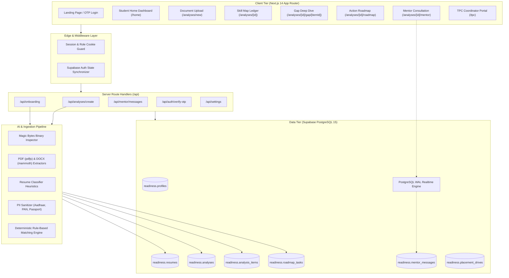
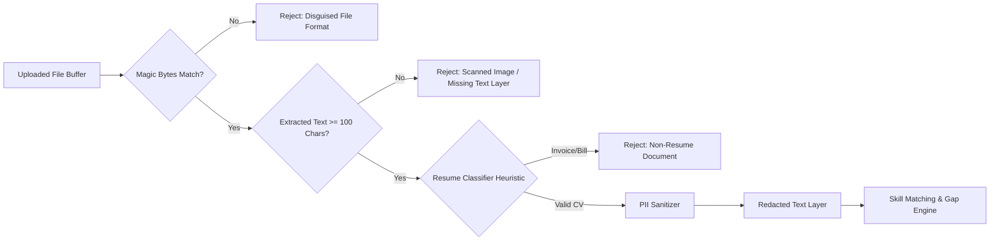
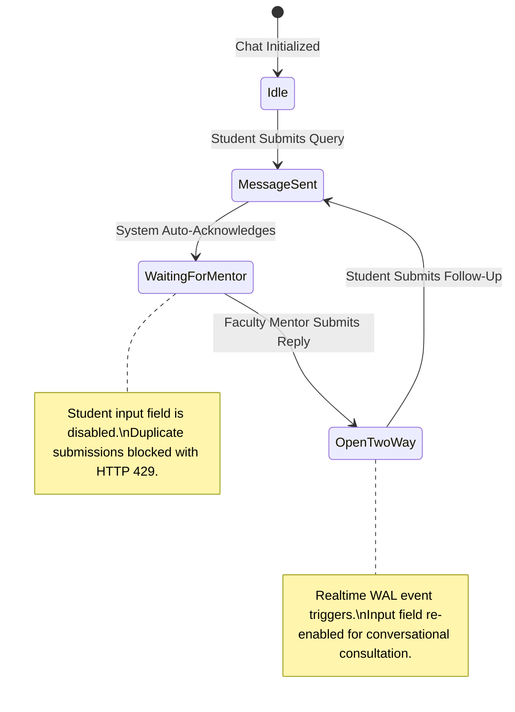
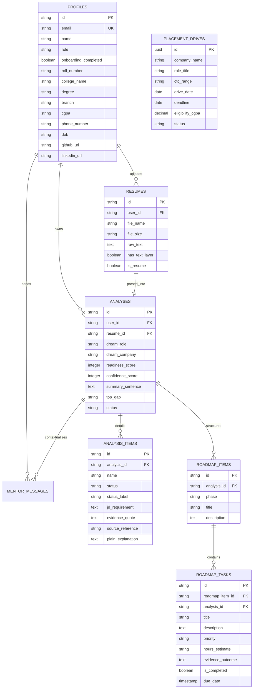

# System Architecture & Technical Specifications

> **Technical Architecture, Security Sandbox, and Data Flow Design for Readiness Skill Gap Platform.**

---

## 1. Architectural Philosophy

Readiness is engineered on three core architectural principles:

1. **Deterministic Grounding Over Hallucination**: AI does not generate arbitrary score percentages. Instead, it computes metrics through strict lexical and semantic matching against actual resume text layers, cross-referencing verbatim evidence sentences.
2. **Schema-Level Multi-Tenant Isolation**: All platform data is partitioned into an isolated PostgreSQL schema (`readiness`), strictly decoupled from external application tables and auth schemas.
3. **Defense-in-Depth Document Intake**: Resumes undergo binary magic-byte inspection, character stream validation, classifier filtering, and PII redaction before entering the diagnostic engine.

---

## 2. High-Level Component Topology

---

## 3. Resume Intake & Security Sandbox

### Magic Bytes Signatures Enforced
- **PDF**: Checks for `%PDF` within the first 1024 bytes. Disallows executable signatures (`MZ` for Windows PE, `\x7fELF` for Linux).
- **DOCX**: Checks for PK Zip headers (`0x50, 0x4B, 0x03, 0x04`) and confirms Microsoft Word XML namespace structures.

### PII Redaction Strategy
To comply with Indian data protection norms (DPDP Act), sensitive government identity documents are systematically redacted prior to storage:
- **Aadhaar Numbers**: `\b[2-9]\d{3}[\s-]?\d{4}[\s-]?\d{4}\b` → `[REDACTED_AADHAAR]`
- **PAN Numbers**: `\b[A-Z]{5}[0-9]{4}[A-Z]{1}\b` → `[REDACTED_PAN]`
- **Indian Passports**: `\b[A-Za-z][1-9]\d{6}\b` → `[REDACTED_PASSPORT]`

---

## 4. Mentor Chat State Machine

The mentor consultation system features an automated queuing state machine:

---

## 5. Relational Entity Relationship Diagram (ERD)

